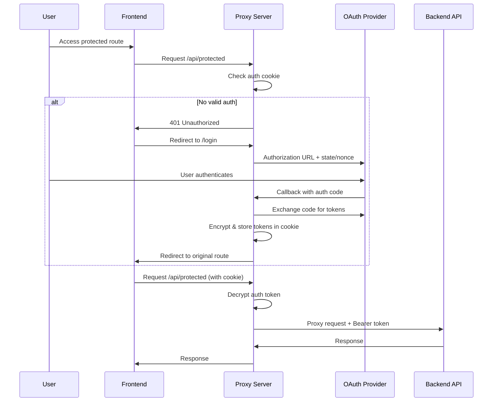

# CLAUDE.md - OAuth2 HTTPS Proxy Server Architecture

**Secure OAuth2 authentication proxy server with encrypted session management - Complete stack-agnostic implementation guide**

---

## 📋 PROJECT OVERVIEW

**Purpose:** OAuth2 authentication proxy server with HTTPS termination, token management, and API proxying  
**Architecture:** Middleware-based proxy with encrypted cookie sessions and automatic token injection  
**Security:** AES-256-GCM encryption, CSRF protection, comprehensive security headers, session management  
**Use Case:** Frontend-backend separation with OAuth2 flow, SPA serving, and authenticated API proxying  

---

## 🏗️ CORE ARCHITECTURE

### **System Components**

```
┌─────────────────┐    ┌─────────────────┐    ┌─────────────────┐
│   Frontend      │    │  Proxy Server   │    │  Backend API    │
│   (SPA Client)  │◄──►│  (This Server)  │◄──►│                 │
└─────────────────┘    └─────────────────┘    └─────────────────┘
                               │
                               ▼
                    ┌─────────────────┐
                    │ OAuth2 Provider │
                    │ (Identity Srv)  │
                    └─────────────────┘
```

### **Request Flow**

1. **Static Content**: Frontend SPA files served directly with caching
2. **API Requests**: Proxied to backend with automatic token injection
3. **Authentication**: OAuth2 authorization code flow with encrypted cookie storage
4. **Session Management**: AES-256-GCM encrypted tokens with expiration handling

---

## 🔐 AUTHENTICATION SYSTEM

### **OAuth2 Authorization Code Flow**



### **Security Features**

- **AES-256-GCM Encryption**: All tokens encrypted with authenticated encryption
- **CSRF Protection**: State/nonce validation in OAuth flow
- **Session Expiration**: Automatic token expiry and cleanup
- **Secure Cookies**: HttpOnly, Secure, SameSite=Strict flags
- **Request Validation**: Comprehensive input validation and sanitization

---

## 🛠️ MIDDLEWARE ARCHITECTURE

### **1. Authentication Middleware**

**Responsibilities:**
- Extract and decrypt authentication tokens from cookies
- Validate token expiration and integrity
- Provide authentication status to request context
- Handle token cleanup on expiration/invalidity

**Key Functions:**
- **extractAuthToken()** - Extract and decrypt authentication tokens from cookies
- **requireAuth()** - Require authentication for protected routes
- **setAuthCookie()** - Store encrypted token in secure cookie  
- **clearAuthCookie()** - Clear authentication cookie

### **2. Proxy Middleware**

**Responsibilities:**
- Proxy API requests to backend with path rewriting
- Inject Bearer tokens for authenticated requests
- Handle backend errors and 401 responses
- Comprehensive request/response logging with sanitization

**Configuration Parameters:**
- **target**: Backend API base URL
- **pathRewrite**: Remove /api prefix from forwarded requests
- **timeout**: 2 minute request timeout
- **onProxyReq**: Inject Authorization Bearer token
- **onProxyRes**: Process backend response and handle errors
- **onError**: Handle connection and timeout errors

### **3. Static File Middleware**

**Responsibilities:**
- Serve frontend build files with optimized caching
- SPA fallback routing for client-side navigation
- Security headers for all static content
- Build validation and health checks

**Caching Strategy:**
- **HTML Files**: No cache (enable deployment updates)
- **Static Assets**: 1 year cache with immutable flag
- **SPA Routes**: Serve index.html with security headers

---

## 🔄 REQUEST ROUTING

### **Route Definitions**

| Pattern | Handler | Purpose |
|---------|---------|---------|
| `/health` | Health Check | Server status and build validation |
| `/login` | OAuth Initiation | Start authorization code flow |
| `/signin-{provider}/` | OAuth Callback | Handle authorization code exchange |
| `/logout` | Session Cleanup | Clear auth and redirect |
| `/auth/status` | Auth Status | Check authentication state |
| `/userinfo` | User Profile | OpenID Connect user information |
| `/api/*` | API Proxy | Authenticated backend proxying |
| `/*` | SPA Fallback | Serve frontend app for client routes |

### **URL Fragment Handling**

OAuth2 implicit flow support with client-side fragment extraction:
- Detect OAuth response in URL fragment
- Convert fragment parameters to query parameters
- Redirect to callback handler for processing
- Handle missing or malformed OAuth responses

---

## 🔒 UNIFIED CERTIFICATE MANAGEMENT

### **Shared Custom Certificate Strategy**

Both Node.js and .NET Core implementations use **identical custom SSL certificates** for perfect symmetry:

**Architecture:**
```
proxy-server/
├── certs/
│   ├── generate-certs.sh          # Unified certificate generation script
│   ├── localhost.pem              # SSL certificate (shared)
│   ├── localhost-key.pem          # Private key (shared)
│   ├── localhost-combined.pem     # Combined format for compatibility
│   └── localhost.pfx              # PKCS#12 format for .NET Core
├── node/                          # Node.js implementation
└── csharp/                        # .NET Core implementation
```

### **Certificate Generation**

**Automated Script:** `proxy-server/certs/generate-certs.sh`
- **OpenSSL-based**: Generates self-signed certificates for localhost development
- **Multiple Formats**: Creates PEM, combined PEM, and PKCS#12 formats for maximum compatibility
- **System Integration**: Automatically installs certificate to macOS system keychain
- **Cross-Platform**: Supports macOS, Linux, and Windows with appropriate instructions

**Usage:**
```bash
# From either implementation directory:
npm run generate-certs

# Or directly:
cd proxy-server/certs
./generate-certs.sh
```

### **Implementation Symmetry**

**Node.js Configuration:**
- Uses separate `localhost.pem` and `localhost-key.pem` files
- Standard Express.js HTTPS server with fs.readFileSync()
- Path: `../certs/localhost-key.pem` and `../certs/localhost.pem`

**.NET Core Configuration:**
- Uses `X509Certificate2.CreateFromPemFile(certPath, keyPath)`
- Same certificate and key files as Node.js implementation
- Automatic fallback to .NET development certificates if files missing

### **System Keychain Integration**

**macOS Automatic Installation:**
```bash
# Automatically executed by generate-certs.sh
sudo security add-trusted-cert -d -r trustRoot -k /Library/Keychains/System.keychain localhost.pem
```

**Benefits:**
- **No Browser Warnings**: Certificate trusted system-wide
- **Professional Development**: Eliminates manual certificate acceptance
- **One-Time Setup**: Install once, works for both implementations
- **True Symmetry**: Identical certificates = zero browser conflicts

### **Cross-Platform Support**

**macOS**: Automatic keychain installation with `security` command
**Linux**: Instructions for `update-ca-certificates` (Ubuntu/Debian)
**Windows**: Manual certificate import instructions

### **Certificate Properties**

```
Subject: C=GR, ST=Attica, L=Athens, O=NBG, OU=IT Department, CN=localhost
SAN: DNS:localhost, DNS:*.localhost, IP:127.0.0.1, IP:::1
Validity: 365 days from generation
Algorithm: RSA 2048-bit with SHA-256
Usage: Digital Signature, Key Encipherment, Server Authentication
```

---

## 🔧 CONFIGURATION SYSTEM

### **Environment Variables**

```bash
# Server Configuration
NODE_ENV=production|development
PROXY_PORT=5443
PROXY_URL=https://your-domain.com
BACKEND_API_URL=http://localhost:3001

# OAuth2 Configuration  
OAUTH_AUTHORITY_URL=https://identity.provider.com
OAUTH_CLIENT_ID=your-client-id
OAUTH_CLIENT_SECRET=your-client-secret
OAUTH_REDIRECT_URI=https://your-domain.com/signin-provider/

# Security Keys (32+ characters each)
COOKIE_ENCRYPTION_KEY=your-secure-32char-encryption-key
SESSION_SECRET=your-secure-session-secret

# SSL Configuration (shared certificates)
SSL_KEY_PATH=../certs/localhost-key.pem
SSL_CERT_PATH=../certs/localhost.pem

# Feature Flags
OAUTH_ENABLED=true
```

### **Configuration Validation**

Startup validation ensures all required configuration is present:
- **Required base configuration**: PORT, BACKEND_URL, ENCRYPTION_KEY
- **OAuth-specific validation**: When OAuth enabled, validate client credentials
- **Security validation**: Encryption key minimum length (32 characters)
- **URL format validation**: Ensure OAuth URLs and redirect URIs are valid

---

## 🔒 SECURITY IMPLEMENTATION

### **Token Encryption**

**AES-256-GCM Implementation:**
- **Algorithm**: AES-256-GCM (Galois/Counter Mode)
- **Key**: 32-byte encryption key from environment
- **IV**: 16-byte random initialization vector per encryption
- **AAD**: Additional authenticated data for application binding
- **Format**: `iv:authTag:encryptedData` (hex-encoded components)

**Security Properties:**
- **Confidentiality**: AES-256 encryption
- **Integrity**: GCM authentication tag
- **Authenticity**: Additional authenticated data (AAD)
- **Randomness**: Cryptographically secure IV generation

### **CSRF Protection**

OAuth2 state parameter implementation:
- Generate cryptographically secure state (32 bytes base64url)
- Generate cryptographically secure nonce (16 bytes base64url)
- Store state/nonce with session ID for callback validation
- Validate state parameter matches stored value on callback
- Clear session data after successful validation

### **Security Headers**

Comprehensive security header implementation:
```
Content-Security-Policy: default-src 'self'; script-src 'self' 'unsafe-inline'; ...
X-Content-Type-Options: nosniff
X-Frame-Options: DENY  
X-XSS-Protection: 1; mode=block
Referrer-Policy: strict-origin-when-cross-origin
```

---

## 📊 ERROR HANDLING & LOGGING

### **Structured Logging**

Request/response logging with sanitization:
- **Request logging**: Method, URL, headers (excluding sensitive data)
- **Response logging**: Status, duration, sanitized response body
- **Error logging**: Error type, stack trace, request context
- **Security logging**: Authentication events, failed attempts

### **Error Categories**

1. **Authentication Errors**: Token validation, OAuth flow issues
2. **Proxy Errors**: Backend connectivity, timeout handling  
3. **Configuration Errors**: Startup validation failures
4. **Security Errors**: CSRF, encryption failures

### **Graceful Degradation**

- **OAuth disabled fallback**: Skip authentication when feature disabled
- **Backend unavailable handling**: Return 502 with retry indication
- **Certificate errors**: Graceful SSL failure handling
- **Session expiry**: Automatic cleanup and re-authentication flow

---

## 🚀 DEPLOYMENT PATTERNS

### **Production Setup**

```bash
# SSL Certificate Installation
cp production.key certs/server-key.pem
cp production.crt certs/server-cert.pem

# Environment Configuration
NODE_ENV=production
PROXY_PORT=443
COOKIE_ENCRYPTION_KEY=$(openssl rand -hex 32)
SESSION_SECRET=$(openssl rand -hex 32)

# Process Management
# Start with process manager (PM2, systemd, etc.)
# Configure auto-restart and log rotation
```

### **Container Deployment**

**Dockerfile Requirements:**
- Base image with runtime environment
- Copy application code and dependencies
- Mount SSL certificates as volume
- Expose HTTPS port (443 or 5443)
- Set production environment variables

**Container Configuration:**
- **Volumes**: `/app/certs` for SSL certificates
- **Environment**: Production environment variables
- **Port**: Expose configured HTTPS port
- **Health Check**: HTTP GET /health endpoint

### **Load Balancer Integration**

**Reverse Proxy Configuration:**
- **SSL Termination**: Handle SSL at load balancer or proxy server
- **Header Forwarding**: Preserve X-Real-IP, X-Forwarded-For
- **Session Affinity**: Not required (stateless with encrypted cookies)
- **Health Checks**: Configure /health endpoint monitoring

---

## 🔧 STACK-AGNOSTIC IMPLEMENTATION

### **Technology Substitutions**

| Component | Example Technologies |
|-----------|---------------------|
| **Web Framework** | Express.js, FastAPI, Flask, Spring Boot, ASP.NET Core, Gin, Echo |
| **Proxy Library** | http-proxy-middleware, nginx proxy_pass, Apache mod_proxy, custom HTTP client |
| **Encryption** | Node crypto, OpenSSL, libsodium, platform crypto APIs |
| **Session Storage** | In-memory Map, Redis, database, encrypted JWT |
| **SSL/TLS** | Application-level HTTPS, nginx, Apache, cloud load balancer |

### **Core Patterns (Framework Agnostic)**

1. **Middleware Chain Pattern**
   ```
   Request → Auth Check → Token Injection → Proxy → Response
   ```

2. **OAuth2 State Machine**
   ```
   Unauthenticated → Auth Request → Callback → Token Exchange → Authenticated
   ```

3. **Encrypted Session Pattern**
   ```
   Token Data → Encrypt → Cookie → Decrypt → Validation → Use
   ```

### **Essential Components**

Regardless of technology stack, these components are required:

1. **HTTPS Server** with SSL certificate handling
2. **OAuth2 Client** implementing authorization code flow
3. **Encryption Library** for AES-256-GCM token storage
4. **HTTP Proxy** with header manipulation capabilities
5. **Static File Server** with SPA routing support
6. **Session Management** with expiration and cleanup
7. **Security Headers** implementation
8. **Comprehensive Logging** with sensitive data sanitization

### **Implementation Checklist**

**Authentication Flow:**
- [ ] OAuth2 authorization URL generation with state/nonce
- [ ] Callback handler with code exchange
- [ ] Token encryption and secure cookie storage
- [ ] Token extraction and validation middleware
- [ ] Automatic token cleanup on expiration

**Proxy Functionality:**
- [ ] HTTP request proxying with path rewriting
- [ ] Bearer token injection for authenticated requests
- [ ] Backend error handling and 401 response processing
- [ ] Request/response logging with sanitization

**Security Features:**
- [ ] AES-256-GCM encryption implementation
- [ ] CSRF protection with state validation
- [ ] Comprehensive security headers
- [ ] Input validation and sanitization
- [ ] SSL/TLS configuration

**Static File Serving:**
- [ ] Frontend asset serving with caching
- [ ] SPA routing fallback
- [ ] Build validation and health checks

---

## 📏 CONFIGURATION TEMPLATES

### **Development Environment**

```bash
# Development configuration
NODE_ENV=development
PROXY_PORT=5443
PROXY_URL=https://localhost:5443
BACKEND_API_URL=http://localhost:3001
OAUTH_AUTHORITY_URL=https://identity-dev.example.com
OAUTH_ENABLED=true
SSL_KEY_PATH=./certs/localhost-key.pem
SSL_CERT_PATH=./certs/localhost.pem
```

### **Production Environment**

```bash
# Production configuration
NODE_ENV=production
PROXY_PORT=443
PROXY_URL=https://app.example.com
BACKEND_API_URL=http://api-internal:3001
OAUTH_AUTHORITY_URL=https://identity.example.com
OAUTH_ENABLED=true
SSL_KEY_PATH=/etc/ssl/private/app.key
SSL_CERT_PATH=/etc/ssl/certs/app.crt
```

### **Testing Environment**

```bash
# Test configuration
NODE_ENV=test
PROXY_PORT=5444
OAUTH_ENABLED=false  # Disable OAuth for testing
BACKEND_API_URL=http://mock-api:3001
COOKIE_ENCRYPTION_KEY=test-key-32-characters-minimum-
```

---

This documentation provides a complete, stack-agnostic guide for implementing an OAuth2 authentication proxy server with encrypted session management. The patterns and architecture can be adapted to any technology stack while maintaining security and functionality requirements.